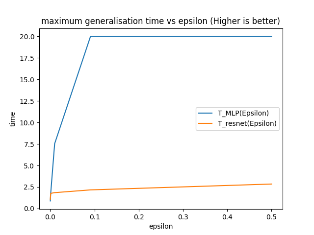
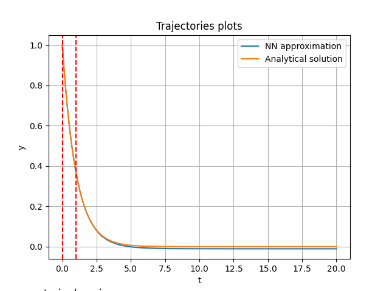

# Perso_Experiments
In this repo you'll find my computer (Python) experiences, each notebook exploring a theme I've been wondering about in my spare time. 

- Learning ODE: I wanted to compare the ability of (little) neuronal network to learn simple ODE and how efficient they are for generalization. (short notebook)
- |---|---|
  || |
